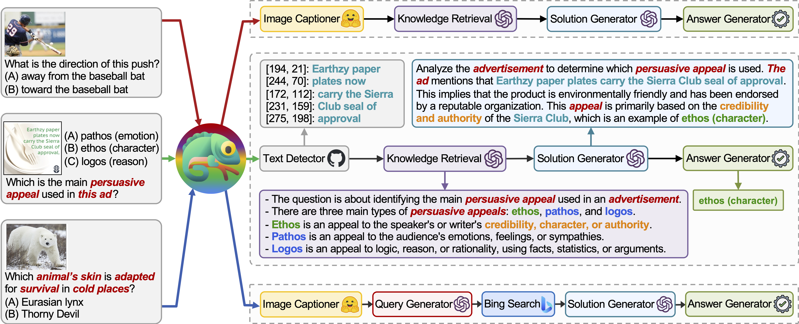
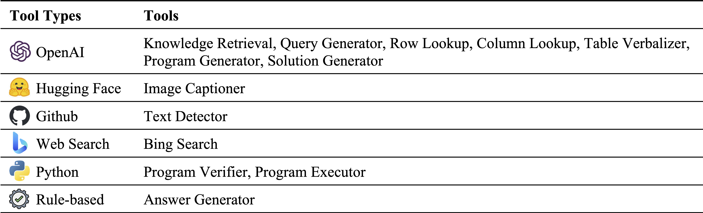
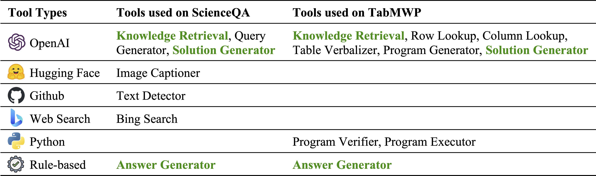
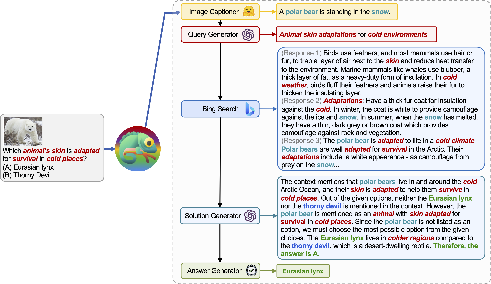
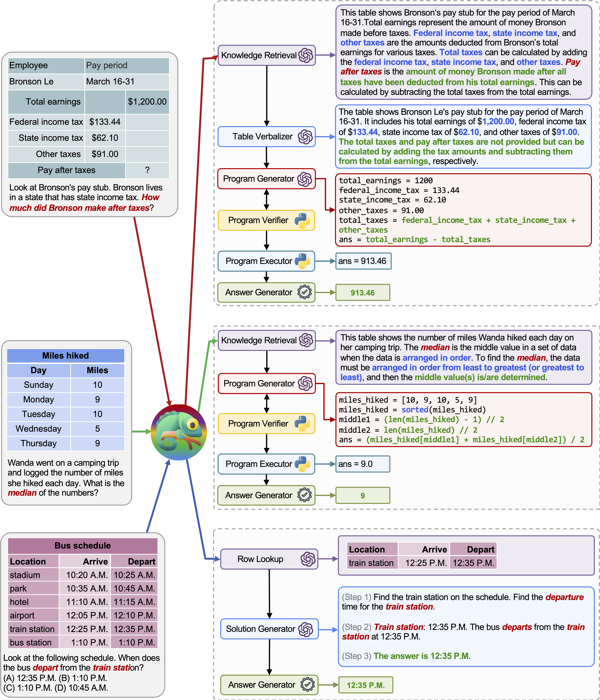
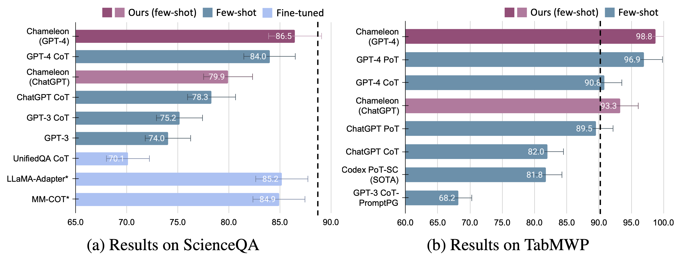
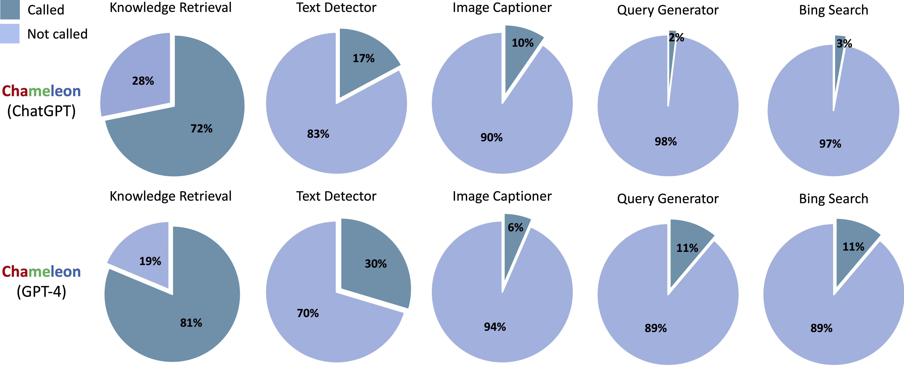
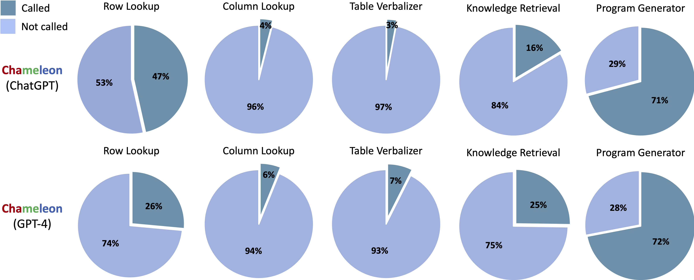
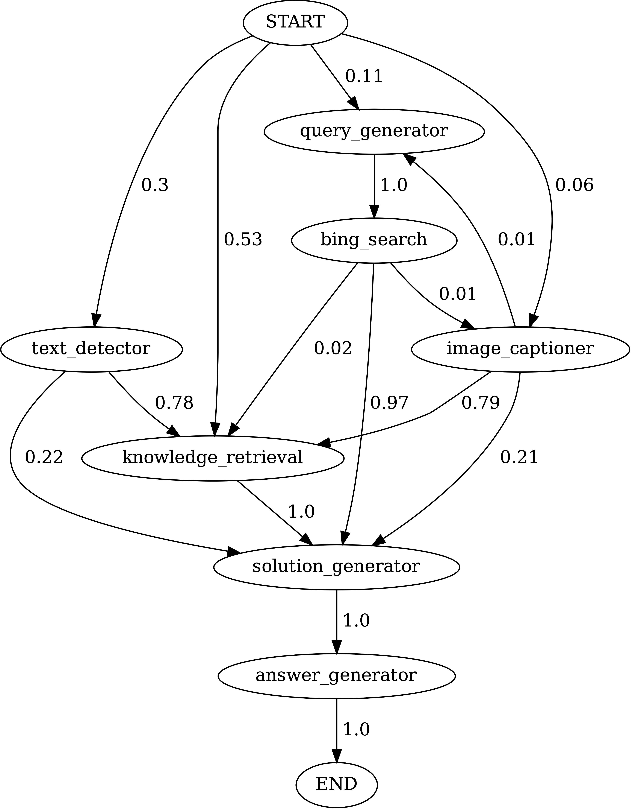
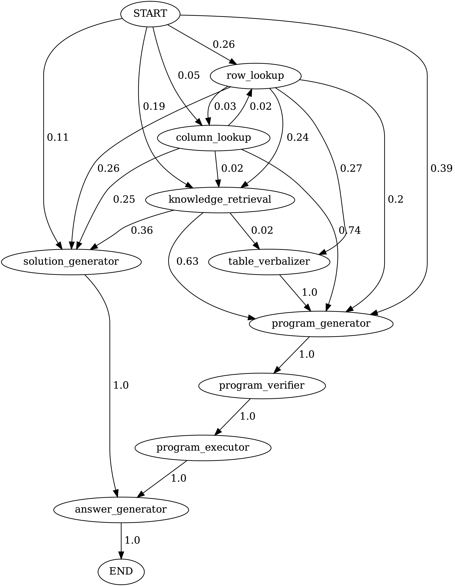

# :lizard: Chameleon: Plug-and-Play Compositional Reasoning with GPT-4

 
 
 
 
 


Code for the Paper "[Chameleon: Plug-and-Play Compositional Reasoning with Large Language Models](https://arxiv.org/abs/2304.09842)".

:bell: If you have any questions or suggestions, please don't hesitate to let us know. You can directly email [Pan Lu](https://lupantech.github.io/) using the email address lupantech@gmail.com, comment on the [Twitter](https://twitter.com/lupantech/status/1648879085115052033), or post an issue on this repository.

[[Project Page](https://chameleon-llm.github.io/)] [[Paper](https://arxiv.org/abs/2304.09842)] [[Twitter](https://twitter.com/lupantech/status/1648879085115052033)] [[Linkedin](https://www.linkedin.com/feed/update/urn:li:activity:7056703894063644672)] [[YouTube](https://www.youtube.com/watch?v=EWFixIk4vjs&ab_channel=WorldofAI)] [[Slides](https://lupantech.github.io/docs/Chameleon_LLM_Pan_Lu_Google_Brain_2023.05.05.pdf)]

<p align="center">
     <br>
  Tentative logo for <b>Chameleon</b>.
</p>

## 💥 News 💥

- **[2023.05.06]** Thrilled to see that our Chameleon paper has been ranked **#1** out of 1,682 AI papers by [AlphaSignal](https://alphasignalai.beehiiv.com/p/weeks-top-5-ai-papers?utm_source=alphasignalai.beehiiv.com&utm_medium=newsletter&utm_campaign=this-week-s-top-5-ai-papers). 
- **[2023.05.05]** We are excited to share that Pan Lu was invited to deliver a talk to the Reasoning Team at Google Brain. View the presentation slides here: [[Slides](https://lupantech.github.io/docs/Chameleon_LLM_Pan_Lu_Google_Brain_2023.05.05.pdf)]
- **[2023.04.24]** Our work has been featured in a [MarkTechPost](https://www.marktechpost.com/2023/04/24/meet-chameleon-a-plug-and-play-compositional-reasoning-framework-that-harnesses-the-capabilities-of-large-language-models/) article.
- **[2023.04.23]** Our research has been recognized as one of the "Top ML Papers of the Week" by [DAIR.AI](https://www.linkedin.com/pulse/top-ml-papers-week-dair-ai-8e/?trackingId=w6D1Ow8FxKSTjgdFuwgYnQ%3D%3D).
- **[2023.04.22]** Thrilled to announce that our work has been featured on [WorldofAI](https://www.youtube.com/watch?v=EWFixIk4vjs&ab_channel=WorldofAI)'s [YouTube channel](https://www.youtube.com/watch?v=EWFixIk4vjs&ab_channel=WorldofAI)!
- **[2023.04.21]** Our work is the trending project on https://trends.vercel.app. [[Link](https://raw.githubusercontent.com/lupantech/chameleon-llm/main/assets/trend.png)]
- **[2023.04.20]** Huge thanks to [John Nay](https://twitter.com/johnjnay/status/1649036276627132418) for sharing our work on [Twitter](https://twitter.com/johnjnay/status/1649036276627132418)!
- **[2023.04.19]** Our research is now listed on [Papers with Code](https://paperswithcode.com/paper/chameleon-plug-and-play-compositional).
- **[2023.04.19]** We appreciate [Aran Komatsuzaki](https://twitter.com/arankomatsuzaki/status/1648848332977221632) for featuring our work on [Twitter](https://twitter.com/arankomatsuzaki/status/1648848332977221632) in a timely manner!
- **[2023.04.19]** Special thanks to [@_akhaliq](https://twitter.com/_akhaliq/status/1648851856930533378) for promptly sharing our work on [Twitter](https://twitter.com/_akhaliq/status/1648851856930533378)!
- **[2023.04.19]** Visit our project's homepage at [Chameleon-LLM](https://chameleon-llm.github.io/).
- **[2023.04.19]** Our paper is now accessible at https://arxiv.org/abs/2304.09842.


## :lizard: About Chameleon

**Chameleon** is a plug-and-play compositional reasoning framework that augments LLMs with various types of tools. **Chameleon** synthesizes programs to compose various tools, including LLM models, off-the-shelf vision models, web search engines, Python functions, and rule-based modules tailored to user interests. Built on top of an LLM as a natural language planner, **Chameleon** infers the appropriate sequence of tools to compose and execute in order to generate a final response. 



We showcase the adaptability and effectiveness of **Chameleon** on two tasks: [ScienceQA](https://scienceqa.github.io/) and [TabMWP](https://promptpg.github.io/). Notably, **Chameleon** with GPT-4 achieves an 86.54% accuracy on ScienceQA, significantly improving upon the best published few-shot model by 11.37%; using GPT-4 as the underlying LLM, **Chameleon** achieves a 17.0% increase over the state-of-the-art model, leading to a 98.78% overall accuracy on TabMWP. Further studies suggest that using GPT-4 as a planner exhibits more consistent and rational tool selection and is able to infer potential constraints given the instructions, compared to other LLMs like ChatGPT.

For more details, you can find our project page [here](https://chameleon-llm.github.io/) and our paper [here](https://arxiv.org/pdf/2304.09842.pdf).

## :tv: YouTube Video

We would like to express our immense gratitude to [WorldofAI](https://www.youtube.com/@intheworldofai) for featuring and introducing our work on [YouTube](https://www.youtube.com/watch?v=EWFixIk4vjs&ab_channel=WorldofAI)!

[](https://www.youtube.com/watch?v=EWFixIk4vjs)


## :star: Star History

[](https://star-history.com/#lupantech/chameleon-llm&Date)


## 🐙 Requirements

- [OpenAI API key](https://platform.openai.com/account/api-keys)
- [Bing Search API](https://www.microsoft.com/en-us/bing/apis/bing-web-search-api.) (If you want to enable the bing search module but the module is optional)

Install all required python dependencies (generated by `pipreqs`):

```
python==3.8.10
huggingface-hub
numpy==1.23.2
openai==0.23.0
pandas==1.4.3
transformers==4.21.1
requests==2.28.1
```

Install all required python dependencies (you can skip this step if you have set up the dependencies before and the versions are not strictly required):

```
pip install -r requirements.txt
```


## ⚠️ Configuration ⚠️

### OpenAI API Key

Obtain your OpenAI API key from: https://platform.openai.com/account/api-keys.

To use OpenAI API key for **Chameleon**, you **NEED** to have billing set up (AKA paid account).

You can set up paid account at https://platform.openai.com/account/billing/overview.

### Bing Search API Key (Optional)

Obtain your Bing Search API key from: https://www.microsoft.com/en-us/bing/apis/bing-web-search-api.

The Bing Search API key is **optional**. Failure to set up this key will lead to a slight performance drop on the ScienceQA task.


## :hammer_and_wrench: Module Inventory

### Different Tools in Chameleon

 Different types of tools in our module inventory:



### Tool Subset

Tools used on ScienceQA and TabMWP, respectively. The reusable tools in two tasks are highlighted in green:




## 🤖 Run Chameleon on ScienceQA

Science Question Answering ([ScienceQA](https://scienceqa.github.io/)) is a multi-modal question-answering benchmark covering a wide range of scientific topics over diverse contexts. The ScienceQA dataset is provided in [`data/scienceqa`](https://github.com/lupantech/chameleon-llm/tree/main/data/scienceqa). For more details, you can explore the dataset and check out the [Explore](https://scienceqa.github.io/explore.html) page and [Visualize](https://scienceqa.github.io/visualize.html) page.

For the current version, the results for the `Image Captioner` and `Text Detector` are off-the-shelf and stored in `data/scienceqa/captions.json` and `data/scienceqa/ocrs.json`, respectively. The live calling these two modules are coming soon!

To run **Chameleon** (GPT-4):

```sh
cd run_scienceqa

python run.py \
--model chameleon \
--label chameleon_gpt4 \
--policy_engine gpt-4 \
--kr_engine gpt-4 \
--qg_engine gpt-4 \
--sg_engine gpt-4 \
--test_split test \
--test_number -1
```

It will generate the predictions and save the results at `results/scienceqa/chameleon_gpt4_test.json`,  `results/scienceqa/chameleon_gpt4_test_cache.jsonl`, and  `results/scienceqa/chameleon_gpt4_test_cache.json`.

We can get the accuracy metrics on average and across different question classes by running:

```sh
python evaluate.py \
--data_file ../data/scienceqa/problems.json \
--result_root ../results/scienceqa \
--result_files chameleon_chatgpt_test_cache.jsonl
```

To run **Chameleon** (ChatGPT):

```sh
python run.py \
--model chameleon \
--label chameleon_gpt4 \
--policy_engine gpt-3.5-turbo \
--kr_engine gpt-3.5-turbo \
--qg_engine gpt-3.5-turbo \
--sg_engine gpt-3.5-turbo \
--test_split test \
--test_number -1
```

Our **Chameleon** is a generalized form of the [CoT (chain-of-thought)](https://arxiv.org/abs/2201.11903) method, where the generated program is a sequence of `Solution Generator` and `Answer Generator`. By passing `--model` as `cot`,  `modules` is set as `["solution_generator", "answer_generator"]`.

To run CoT (chain-of-thought prompted) GPT-4:

```sh
python run.py \
--model cot \
--label cot_gpt4 \
--sg_engine gpt-4 \
--test_split test \
--test_number -1
```

To run CoT (chain-of-thought prompted) ChatGPT:

```sh
python run.py \
--model cot \
--label cot_chatgpt \
--sg_engine gpt-4 \
--test_split test \
--test_number -1
```


## 🤖 Run Chameleon on TabMWP

The TabMWP dataset contains 38,431 tabular math word problems. Each question in TabMWP is aligned with a tabular context, which is presented as an image, semi-structured text, and a structured table. The TabMWP dataset is provided in [`data/tabmwp`](https://github.com/lupantech/PromptPG/blob/main/data/tabmwp). For more details, you can explore the datatset and check out the [Explore](https://promptpg.github.io/explore.html) page and [Visualize](https://promptpg.github.io/visualize.html) page.

To run **Chameleon** (GPT-4):

```sh
cd run_tabmwp

python run.py \
--model chameleon \
--label chameleon_gpt4 \
--test_split test \
--policy_engine gpt-4 \
--rl_engine gpt-4 \
--cl_engine gpt-4 \
--tv_engine gpt-4 \
--kr_engine gpt-4 \
--sg_engine gpt-4 \
--pg_engine gpt-4 \
--test_number -1 \
--rl_cell_threshold 18 \
--cl_cell_threshold 18
```

It will generate the predictions and save the results at `results/tabmwp/chameleon_gpt4_test.json`,  `results/tabmwp/chameleon_gpt4_test_cache.jsonl`, and  `results/tabmwp/chameleon_gpt4_test_cache.json`.

We can get the accuracy metrics on average and across different question classes by running:

```sh
python evaluate.py \
--data_file ../data/tabmwp/problems_test.json \
--result_root ../results/tabmwp \
--result_files chameleon_chatgpt_test_cache.jsonl
```

To run **Chameleon** (ChatGPT):

```sh
python run.py \
--model chameleon \
--label chameleon_chatgpt \
--test_split test \
--policy_engine gpt-3.5-turbo \
--rl_engine gpt-3.5-turbo \
--cl_engine gpt-3.5-turbo \
--tv_engine gpt-3.5-turbo \
--kr_engine gpt-3.5-turbo \
--sg_engine gpt-3.5-turbo \
--pg_engine gpt-3.5-turbo \
--test_number -1 \
--rl_cell_threshold 18 \
--cl_cell_threshold 18
```

To run CoT (chain-of-thought prompted) GPT-4:

```sh
python run.py \
--model cot \
--label cot_gpt4 \
--test_split test \
--sg_engine gpt-4 \
--test_number -1
```

To run CoT (chain-of-thought prompted) ChatGPT:

```sh
python run.py \
--model cot \
--label cot_chatgpt \
--test_split test \
--sg_engine gpt-3.5-turbo \
--test_number -1
```

Our **Chameleon** is a generalized form of the [PoT (program-of-thought)](https://arxiv.org/abs/2211.12588) method, where the generated program is a sequence of `Program Generator`,  `Program Executor`, and `Answer Generator`. By passing `--model` as `pot`,  `modules` is set as `["program_generator", "program_executor", "answer_generator"]`.

To run PoT (program-of-thought prompted) GPT-4:

```sh
python run.py \
--model pot \
--label pot_gpt4 \
--test_split test \
--pg_engine gpt-4 \
--test_number -1
```

To run PoT (program-of-thought prompted) ChatGPT:

```sh
python run.py \
--model pot \
--label pot_chatgpt \
--test_split test \
--pg_engine gpt-3.5-turbo \
--test_number -1
```

## 😈 More Examples

### More examples on ScienceQA dataset



**Chameleon** (GPT-4) is able to adapt to different input queries by generating programs that compose various tools and executing them sequentially to obtain the correct answers. 

For instance, the query above asks, “Which animal’s skin is adapted for survival in cold places?”, which involves scientific terminology related to animal survival. Consequently, the planner decides to rely on the *Bing search* engine for domain-specific knowledge, benefiting from the numerous online resources available.

### More examples on TabMWP



The adaptability and versatility of our **Chameleon** for various queries are also observed on TabMWP, as illustrated in the examples in the figure above. 

The first example involves mathematical reasoning on a tax form. **Chameleon** (1) calls the knowledge retrieval model to recall basic knowledge that assists in understanding such domain-specific tables, (2) describes the table in a more readable natural language format, and (3) finally relies on program-aided tools to perform precise computations. 

In the second example, the system generates Python code that closely aligns with the background knowledge provided by the knowledge retrieval model. 

The third example requires the system to locate the cell in a large tabular context given the input query. **Chameleon** calls the row lookup model to help accurately locate the relevant rows and generate the language solution via an LLM model, instead of relying on program-based tools.


## :chart_with_upwards_trend: How Good is Chameleon?

Significant improvements are observed for **Chameleon** over both fine-tuned models and few-shot prompted GPT-4/ChatGPT:



To visualize the predictions made by **Chameleon**, simply execute the Jupyter Notebook corresponding to your specific task: `notebooks/results_viewer_[TASK].ipynb`. This will provide an interactive and user-friendly way to explore the results generated by the model. Alternatively, explore our [project page](https://chameleon-llm.github.io/) for more information and options.


## :slot_machine: What Plans Are Chameleon Learning?

### Tool Use

Tools called in the generated programs from **Chameleon** (ChatGPT) and **Chameleon** (GPT-4) on ScienceQA:



Tools called in the generated programs from Chameleon (ChatGPT) and Chameleon (GPT-4) on TabMWP:



### Transition Graph

Execute `notebooks/transition_[TASK]_[Model]_Engine.ipynb` to visualize the module transition graph for programs generated on the test set.

Transitions between modules in programs generated by **Chameleon** (GPT-4) on ScienceQA. START is the start symbol, END is a terminal symbol and the others are non-terminal symbols.



Transitions between modules in programs generated by **Chameleon** (GPT-4) on TabMWPQA. START is the start symbol, END is a terminal symbol and the others are non-terminal symbols.





## :smile_cat: Want to Develop A New Task?

- **Construct the module inventory**: Create prompts for LLM-based models within the `demos` directory. Define the input, execution, and output for each module in `model.py`.
- **Develop the LLM planner**: Provide a comprehensive description of the module inventory and include a few examples that demonstrate how to map queries to the target program.
- **Implement the data loader and evaluation method**: Define the data loader within `model.py`. To modify the evaluation method, update the corresponding section in `main.py`.
- **Enjoy the process**: With the groundwork in place, it's time to have fun and dive into the task at hand!


## :coffee: Stay Connected!

Fantastic! I'm always open to engaging discussions, collaborations, or even just sharing a virtual coffee. To get in touch, visit [Pan Lu](https://lupantech.github.io/)'s homepage for contact information.


## :white_check_mark: Cite

If you find **Chameleon** useful for your research and applications, please kindly cite using this BibTeX:

```latex
@article{lu2023chameleon,
  title={Chameleon: Plug-and-Play Compositional Reasoning with Large Language Models},
  author={Lu, Pan and Peng, Baolin and Cheng, Hao and Galley, Michel and Chang, Kai-Wei and Wu, Ying Nian and Zhu, Song-Chun and Gao, Jianfeng},
  journal={arXiv preprint arXiv:2304.09842},
  year={2023}
}
```
